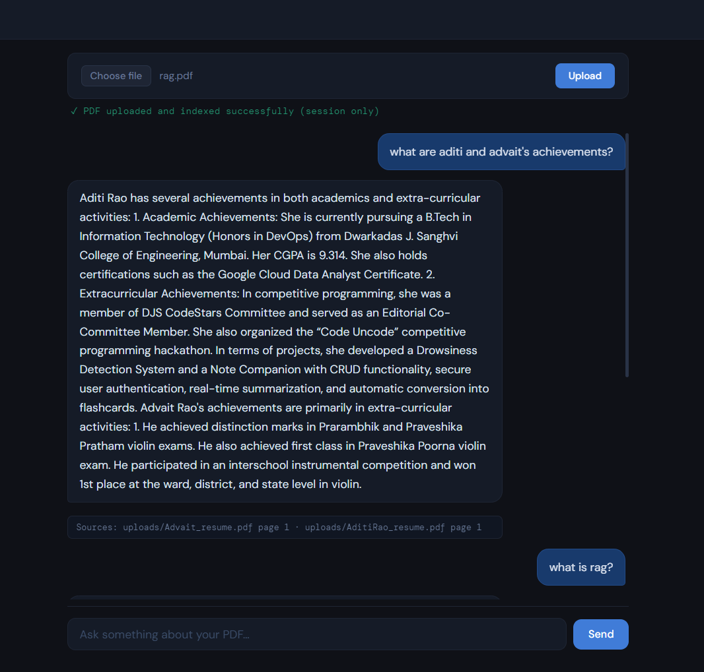
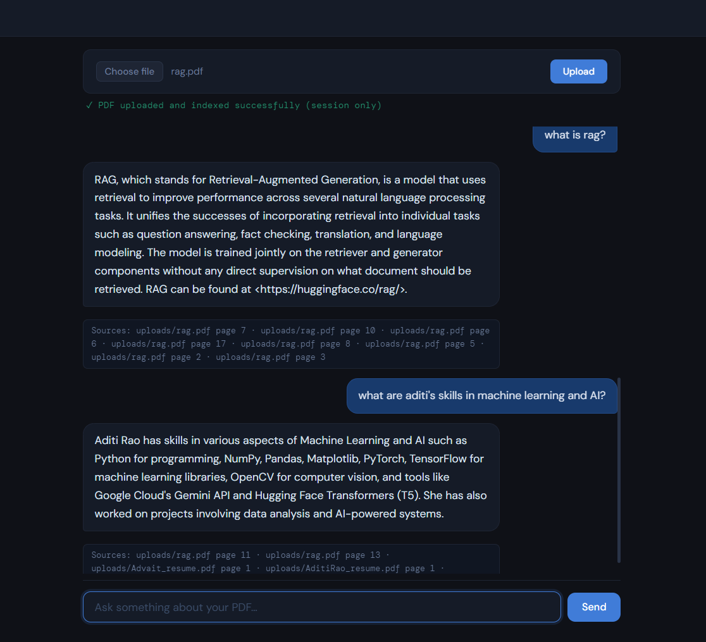

# RAG PDF Chatbot (Hybrid Retrieval + Local LLM)

A **Retrieval-Augmented Generation (RAG) based PDF chatbot** that allows users to upload documents and ask questions about them.
The system uses **hybrid retrieval (FAISS + BM25)** and a **local LLM (Ollama)** to generate answers with source citations.

The application is fully **Dockerized** for easy deployment and reproducible setup.

---

## Features

* **Multi-PDF Upload Support**
* **Hybrid Retrieval**

  * Dense search using FAISS
  * Keyword search using BM25
* **Local LLM Inference (Ollama)**
* **Source Citation (page-level references)**
* **In-memory indexing (session-based storage)**
* **Flask Web Interface**
* **Dockerized Deployment**
* **Interactive Chat UI**
* **Session-based document storage (cleared on shutdown)**

---

## System Architecture

```
User → Flask UI → RAG Pipeline
                  ├── Embedding Model (Sentence Transformers)
                  ├── FAISS Vector Search
                  ├── BM25 Keyword Search
                  └── Ollama LLM (Mistral)
```

### Pipeline Flow

1. Upload PDF
2. Extract text
3. Chunk document
4. Generate embeddings
5. Store in FAISS + BM25
6. Retrieve relevant chunks
7. Generate answer using local LLM
8. Return answer with sources

---

## Tech Stack

* **Backend:** Flask
* **Embeddings:** Sentence Transformers
* **Vector Search:** FAISS
* **Keyword Search:** BM25
* **LLM:** Ollama (Mistral)
* **PDF Processing:** PyMuPDF
* **Containerization:** Docker + Docker Compose

---

## Installation & Setup

### Option 1 — Run with Docker (Recommended)

This is the easiest way to run the project.

### Prerequisites

* Install Docker Desktop
  https://www.docker.com/products/docker-desktop/

---

### Run the application

```bash
git clone https://github.com/aditirao29/rag_pdf_chatbot
cd rag_pdf_chatbot

docker compose up --build
```

Open in browser:

```
http://localhost:5000
```

---

### Stop the application

```bash
docker compose down
```

---

## Option 2 — Local Python Setup (Without Docker)

### Requirements

* Python 3.10+
* Ollama installed
  https://ollama.com

---

### Setup

```bash
git clone https://github.com/aditirao29/rag_pdf_chatbot
cd rag_pdf_chatbot

python -m venv venv
venv\Scripts\activate   # Windows
pip install -r requirements.txt

ollama run mistral
python app.py
```

Open:

```
http://localhost:5000
```

---

## Usage

1. Start the application
2. Upload one or more PDF files
3. Ask questions about uploaded documents
4. View answers with source references

Uploaded documents are stored in memory and cleared when the app stops.

---

## Project Structure

```
rag_pdf_chatbot/
│
├── app.py
├── Dockerfile
├── docker-compose.yml
├── requirements.txt
├── templates/
├── ingestion/
├── embeddings/
├── vector_store/
├── rag/
├── llm/
└── uploads/ (runtime only)
```

---

## Design Decisions

* **Session-based storage:** Documents are not persisted for privacy.
* **Hybrid retrieval:** Improves retrieval accuracy over single-method search.
* **Local LLM:** Avoids external API dependency and ensures data privacy.
* **Dockerized environment:** Ensures reproducibility and easy deployment.

---

## Screenshots

<p align="center">
  
  
</p>

---

## Future Improvements

* Conversation memory
* Streaming responses
* Better UI/UX
* Authentication support
* Document management dashboard
* Performance optimization

---

## Learning Outcomes

This project demonstrates:

* Retrieval-Augmented Generation (RAG)
* Hybrid search systems
* Vector databases
* Local LLM deployment
* ML system architecture
* Containerized deployment using Docker

---
